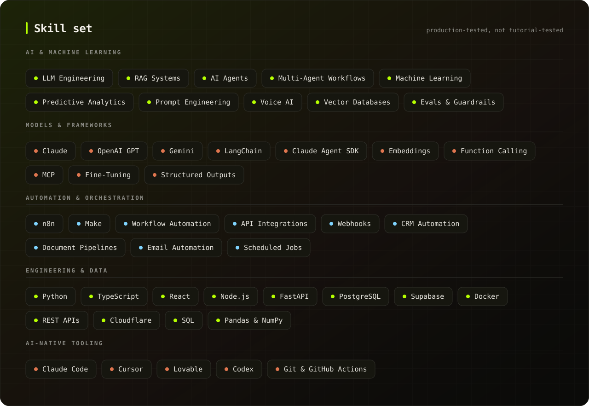
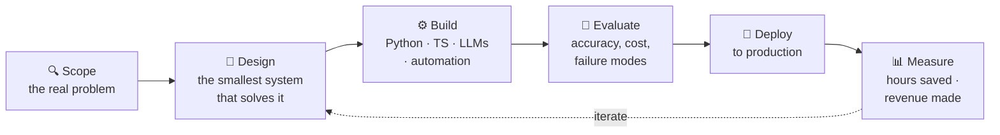

<div align="center">



<br /><br />

**[🌐 Portfolio](https://tayyab-ismail-portfolio.pages.dev) · [💼 LinkedIn](https://www.linkedin.com/in/tayyab-i-509718270) · [📝 Blog](https://tayyab-ismail-portfolio.pages.dev/blog) · [📅 Book a Free Call](https://calendly.com/tayyabismail/30min)**

<br />


</div>

---

## 👋 About me

I'm **Tayyab Ismail** — a Senior Data & AI Engineer who builds and ships **production AI systems** for businesses across the **US, UK, Germany, Australia, India, and Europe**.

I didn't arrive here through a computer science degree. I started in **biotechnology** and pivoted into AI the hard way: by building things, breaking them, and shipping them to real customers. That background is the whole point — I optimise for **business outcomes, not theoretical perfection**.

I work as a **solo operator**. The person who scopes your project is the person who architects it, writes it, and deploys it. No handoffs to juniors, no account managers, no black box.

```text
🚀  30+ AI systems deployed across 12+ industries
🧪  2.5+ years full-time in the AI trenches · 50+ tools tested
🎯  Healthcare · Legal · Real Estate · Dental · Home Services · SaaS
📍  Based in Pakistan · working with clients globally, remote-first
```

> **The filter I apply to every project:** if it doesn't measurably save hours or make money, it doesn't get built.

---

## 🧰 Skill set

<div align="center">

</div>

<div align="center">

<br />

**Models & platforms I build on**


**Engineering stack**


**Where I write the code**


</div>

---

## ⚡ What I build

I build AI that does actual work — not demos.

| | Service | What it means in practice |
|:--:|:--|:--|
| **01** | **AI / ML Solutions & Deployment** | Machine learning built on *your* data. Predictive models and intelligent automation — developed, tested, and deployed to production. |
| **02** | **AI Workflow Automation** | Kill the repetitive work. Emails, documents, approvals, CRM updates, and internal processes running around the clock without a human in the loop. |
| **03** | **AI Voice & Communication** | Voice agents that answer calls, qualify prospects, and book meetings, so you never lose a lead to a missed phone call. |
| **04** | **Customer Support Systems** | AI agents that answer from *your* knowledge base, route tickets, and cut support cost without wrecking the customer experience. |
| **05** | **Custom Software & AI Development** | Internal tools, customer-facing apps, RAG systems, API integrations — built around your workflow, not a template. |
| **06** | **AI Development & Consulting** | Getting your team productive with Claude Code, Cursor, Lovable, and Codex. Setup, workflow design, and training. |

---

## 🏗️ How I ship



---

## 🤝 Worked with

<div align="center">

**HCA** · **LHC** · **Guhr** · **Majori** · **Opoura** · **MGP** · **London Estates** · **Legal Solicitors**

<sub>Healthcare · Legal · Real Estate · Dental · Home Services · SaaS</sub>

</div>

---

## 📊 GitHub

<div align="center">


<!-- Contribution-graph snake — uncomment AFTER the "Generate snake" Action has run once (see SETUP.md)

-->

</div>

---

## 📖 What I write about

<table>
<tr>
<td width="33%" valign="top">

**[What Does an AI Consultant Actually Do?](https://tayyab-ismail-portfolio.pages.dev/blog/what-does-an-ai-consultant-actually-do)**

<sub>The honest version, without the buzzwords.</sub>

</td>
<td width="33%" valign="top">

**[Machine Learning for Small Businesses, Explained Simply](https://tayyab-ismail-portfolio.pages.dev/blog/machine-learning-for-small-businesses)**

<sub>What ML can realistically do for a 5-person company.</sub>

</td>
<td width="33%" valign="top">

**[AI Chatbots That Actually Solve Problems](https://tayyab-ismail-portfolio.pages.dev/blog/ai-chatbots-that-actually-solve-problems)**

<sub>Why most chatbots fail, and what to build instead.</sub>

</td>
</tr>
<tr>
<td width="33%" valign="top">

**[How to Reduce Support Costs With AI](https://tayyab-ismail-portfolio.pages.dev/blog/reduce-support-costs-with-ai)**

<sub>Cutting ticket volume without wrecking CX.</sub>

</td>
<td width="33%" valign="top">

**[The AI Readiness Assessment](https://tayyab-ismail-portfolio.pages.dev/blog/ai-readiness-assessment)**

<sub>Find out whether your business is actually ready.</sub>

</td>
<td width="33%" valign="top">

**[When You Actually Need Machine Learning](https://tayyab-ismail-portfolio.pages.dev/blog/when-you-actually-need-machine-learning)**

<sub>And the far more common case where you don't.</sub>

</td>
</tr>
</table>

<div align="center"><a href="https://tayyab-ismail-portfolio.pages.dev/blog"><b>Read all articles →</b></a></div>

---

## 📬 Let's talk

If you're a founder, solopreneur, or marketer who wants AI doing real work in your business — not another chatbot demo — book a call. It's free, it's 30 minutes, and you'll leave with a clear answer on whether AI is worth it for your situation.

<div align="center">

### [📅 Book a Free AI Strategy Call →](https://calendly.com/tayyabismail/30min)

[](https://tayyab-ismail-portfolio.pages.dev)
[](https://www.linkedin.com/in/tayyab-i-509718270)
[](https://www.instagram.com/tayyabismail.ai)
[](https://www.facebook.com/share/14gmS5ft4Gd/?mibextid=wwXIfr)

</div>

---

<div align="center">
<sub>Built with AI. Shipped with intent. · © 2026 Tayyab Ismail</sub>
</div>
